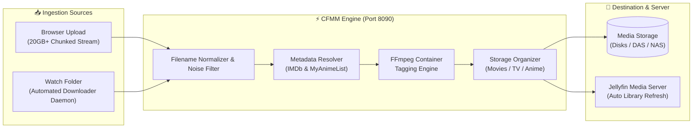

# 🎬 CFlix Media Manager (CFMM)

<div align="center">

[](LICENSE)
[](https://www.python.org/)
[](https://www.docker.com/)
[](https://jellyfin.org/)
[](#-security-architecture)

**The high-performance, automated media ingestion, metadata resolution, and collections synchronizer for Jellyfin media servers.**

</div>

---

## 📖 Overview

**CFlix Media Manager (CFMM)** is a centralized, self-hosted media operations suite designed to eliminate manual file renaming, metadata tagging, folder organization, and collection curation. 

Whether uploading massive 20GB+ 4K Blu-ray remuxes directly through your web browser, auto-ingesting finished torrent/browser downloads from a watch folder, or organizing complex TV series and franchise boxsets in chronological order, CFMM handles the entire pipeline end-to-end with zero manual file management.

---

## 🌟 Key Features



### 1. 🚀 Browser Video Ingest with Chunked Streaming
* **Drag-and-drop uploads** of any size (tested with 20GB+ 4K files) without browser timeout or memory crashes.
* Multi-part chunked streaming with live upload speed (MB/s), percentage bar, and accurate ETA.
* In-flight concurrency locks and integrity validation during chunk reassembly.

### 2. 🧠 Intelligent Metadata Tagging & Clean Filenames
* **Noise Filter**: Automatically strips torrent release tags (`[SubsPlease]`, `x265`, `1080p`, `BDRip`, `DTS-HD`, `AMZN`, CRC32 checksums, and tracker ads).
* **Multi-Source Metadata**: Live integration with **IMDb** for Western movies and shows, and **Jikan (MyAnimeList)** for Anime releases.
* **Auto Series Structure**: Recognizes season and episode patterns (`S01E02`, `1x02`, `Episode 05`) and organizes them cleanly into `Show Name/Season 01/Show Name - S01E01 - Title.ext`.
* **Native FFmpeg Tagging**: Injects official container tags (`title`, `year`, `comment=imdb_id`) directly into video streams before placing files on storage.

### 3. 📦 Automated Collections & BoxSets Synchronizer
* Synchronizes complete franchise collections using TMDb BoxSet IDs.
* Full chronological franchise ordering (Marvel Cinematic Universe chronological order, Star Wars, DC Extended Universe, Alien, Rocky/Creed, Transformers, etc.).
* Missing item tracking: Injects `.disc` placeholders with `(Not Available)` tags and applies custom CSS styling to dim unowned movies and label them with missing badges.

### 4. 👁️ Background Watch Folder Daemon
* Continuously monitors your incoming downloads folder for completed downloads.
* Uses non-blocking process inspection (`fuser`) and size-stability checks to ensure files are 100% finished downloading before touching them.
* One-click batch ingestion of detected files straight into designated media directories.

### 5. 🛡️ Ultra-Secure Role-Based Access Control (RBAC)
* **Direct Media Server Authentication**: No separate user database required. Users log in using their existing Jellyfin server credentials.
* **Server-Side Policy Enforcement**: Checks permissions directly against the Jellyfin server API:
  * **Administrators**: Full access to Server Settings, Directory Creation/Deletion, and BoxSet Syncing.
  * **Media Managers**: Permitted users can upload, tag, and ingest media, but cannot alter server paths or delete directories.
  * **Unauthorized Users**: Access is strictly denied with HTTP 401/403.
* Hardened security stack: HTTPOnly and SameSite session cookies, brute-force rate limiting, and security headers (`nosniff`, `SAMEORIGIN`).

### 6. 📊 Real-Time Live Activity Console
* Live Server-Sent Events (SSE) stream terminal logs directly to the browser dashboard, providing instant visibility into FFmpeg operations, file movements, and API responses.

---

## 🚀 Quick Start with Docker Compose (Recommended)

### 1. Clone the Repository
```bash
git clone https://github.com/Gallogeta/CFlix.git cfmm
cd cfmm
```

### 2. Configure Environment Variables
Copy the template configuration:
```bash
cp .env.example .env
```
Edit `.env` to match your server's IP and storage paths:
```env
PORT=8090
HOST=0.0.0.0

# Jellyfin Server Address
JELLYFIN_URL=http://<YOUR_JELLYFIN_IP>:8096

# Host Storage Paths
MEDIA_ROOT=/media
MOVIES_DIR=/media/movies
SERIES_DIR=/media/tv
ANIME_DIR=/media/anime
ADULT_DIR=/media/adult

# Watch Folder for Auto-Ingestion
WATCH_DIR=/downloads
STAGING_DIR=/downloads/.staging
```

### 3. Start the Container
```bash
docker compose up -d --build
```

### 4. Open the Web Dashboard
Open your browser and navigate to:
```text
http://<your-server-ip>:8090
```

---

## ⚙️ First-Time Setup Guide

1. **Log in with Media Server Credentials**:
   * On first launch, enter your **Media Server URL** (e.g. `http://<your-jellyfin-ip>:8096`), your **Jellyfin Username**, and **Password**.
   * The server will verify your credentials and permissions.

2. **Verify Paths in Settings**:
   * Navigate to the **Settings** tab.
   * Review your media storage paths (`/media/movies`, `/media/tv`, `/downloads`).
   * Click **Validate Paths & Auto-Create Missing** to ensure directories are created with write permissions.
   * Click **Save Settings**. Configuration is saved to persistent `data/settings.json`.

---

## 🔒 Security Architecture

| Security Layer | Implementation Details |
| :--- | :--- |
| **Authentication** | Direct upstream authentication via Jellyfin `/Users/AuthenticateByName` REST API |
| **Authorization (RBAC)** | Server-side policy inspection (`IsAdministrator`, `EnableContentDownloading`, `EnableMediaConversion`) |
| **Session Security** | Cryptographically secure tokens (`secrets.token_urlsafe(32)`) with `HttpOnly` & `SameSite=Lax` cookies |
| **Brute-Force Mitigation** | Built-in IP rate limiter locking out repeat authentication failures |
| **HTTP Security Headers** | `X-Content-Type-Options: nosniff`, `X-Frame-Options: SAMEORIGIN`, `X-XSS-Protection: 1` |
| **Input Sanitization** | Strict filename cleaning preventing directory traversal attacks (`../`, `:`, `\`) |

---

## 📁 Repository Structure

```text
├── app.py                   # AIOHTTP Application server, REST API, & Auth Middleware
├── config.py                # Configuration manager & settings persistence
├── processor.py             # Ingestion pipeline & FFmpeg tagging runner
├── metadata.py              # IMDb & MyAnimeList search & title sanitization
├── collections_manager.py   # TMDb BoxSets, franchise ordering & missing item synchronizer
├── directories_manager.py   # Multi-library & storage directory management
├── watcher.py               # Background downloads folder monitoring daemon
├── logger.py                # Thread-safe logging & Server-Sent Events (SSE) broadcaster
├── templates/
│   └── index.html           # High-performance glassmorphism UI dashboard
├── static/
│   ├── css/style.css        # Responsive dashboard stylesheets
│   └── js/app.js            # Client-side single-page app controller
├── data/                    # Persistent storage mount for settings & sessions
├── docker-compose.yml       # Production Docker deployment specification
├── Dockerfile               # Python 3.12 + FFmpeg container image
├── .env.example             # Environment variable template
└── README.md                # Project documentation
```

---

## 🛠️ Bare-Metal / Native Installation (Without Docker)

If you prefer running directly on a Linux host or VM:

### 1. Install System Dependencies
```bash
sudo apt update && sudo apt install -y python3 python3-pip ffmpeg psmisc curl
```

### 2. Install Python Dependencies
```bash
pip install -r requirements.txt --break-system-packages
# or install directly:
pip install aiohttp jinja2 requests
```

### 3. Launch CFMM
```bash
python3 app.py
```
CFMM will bind to `http://0.0.0.0:8090`.

---

## 📄 License

This project is licensed under the GNU General Public License v3.0 (GPL-3.0). See [LICENSE](LICENSE) for details.
